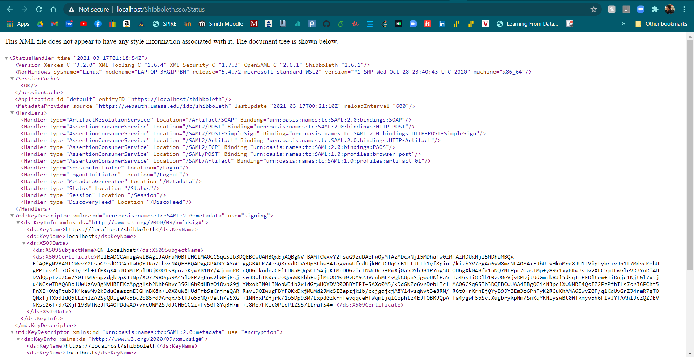
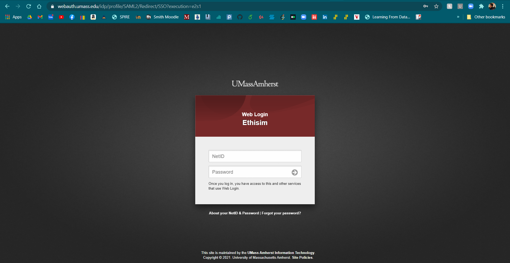

# Setting up and configuring Shibboleth SP with UMass web login 

1. Getting SP config files.
2. Downloading server prerequisites.
3. Create/apply a ssl cert. 
4. Configuring Shibboleth.
5. Checking.


## Getting SP config files

The first step you want to do is to request SP authentication and configuration files.

Go to https://webauth.umass.edu/admin and there you can create and manage pre-existing SP tokens.

Select create new SP and follow the steps using the domain of your app. *For local use and testing, just use `localhost` as your domain.*

## Downloading server prerequisites.

For this project we are using Ubuntu as our server OS. 

Enter these into your terminal in order:

```bash
sudo apt-get update

sudo apt install apache2

sudo systemctl restart apache2 #(or sudo service apache2 restart)

sudo apt-get install libapache2-mod-shib2
```

## Create/apply a ssl cert

Now we need to create or apply a SSL cert for the application domain on your Shibboleth SP.

For a localhost project, we are creating a self signed certificate. 

Run these commands:

```bash
sudo a2enmod ssl

sudo a2ensite default-ssl.conf

sudo mkdir /etc/apache2/ssl && sudo openssl req -x509 -nodes -days 365 -newkey rsa:2048 -keyout /etc/apache2/ssl/apache.key -out /etc/apache2/ssl/apache.crt
```

You will go through a SSL configuration process. Make sure, when asked the common name, you use the same domain name.


## Configuring Shibboleth

Run these commands to enable Shibboleth on the server.

```bash
sudo a2enmod auth_basic
sudo a2enmod shib2
```

Now get the files you downloaded from the first step and put the `sp-key.pem`, `sp-cert.pem`, `shibboleth2.xml`, and `attribute-map.xml` in `/etc/shibboleth/`.


Then we need to edit the service provider configuration file(shibboleth2.xml) using 
```bash
sudo nano /etc/shibboleth/shibboleth2.xml
```

Most of the file should be pre-configured, but look for a block that looks like this.

```xml
<!--  Status reporting service.  -->
<Handler type="Status" Location="/Status" acl="127.0.0.1 ::1"/>
```

Add the local IP of your server to the acl variable before `127.0.0.1 ::1"` in the format `[0.0.0.0/24]` if that doesn't work, replace the `/24` with `/20`.

You can find the ip of your server by running `ifconfig`.


Once the files are in place, restart shibboleth with

`sudo service shibd restart`


## Checking

Now to check if all your sweet sweet work paid off. 


Open 
```
https://idp.shibboleth.com/Shibboleth.sso/Status
``` 
in your browser and should see something like this.



If there are any errors, or it doesn't feel right. You can see the logs at 

`/var/log/shibboleth/shibd.log`

If everything looks good so far, open
```
https://[server ip]/Shibboleth.sso/Login
```

And enjoy the beauty




# Instructions about adding Shibboleth to the CSCF server. 
1. Connect to the CSCF server.
2. Recommendation
3. Download and install Repository Package
4. Installation
5. Creating a new SP
6. Testing

## Connect to the CSCF Server
The host uses the CentOS operating system.
Connect to the CSCF server by using ssh. In our case it was connecting to the server using cerberus@ethisim2.cs.umass.edu. Enter password when prompted.

## Recommendation
To download software and configuration files, installing curl is recommended. Curl can be installed with:
```bash
sudo dnf install curl
```

## Download and install Repository Package
The repository package maintained by the Shibboleth project. This repository contains the up-to-date version of Shibboleth and it is recommended to use this repository. To download and install the repository package:
```bash
sudo curl --output /etc/yum.repos.d/security:shibboleth.repo  https://download.opensuse.org/repositories/security:/shibboleth/CentOS_8/security:shibboleth.repo
```

## Installation
Installing the Shibboleth Service Provider:
For 32-bit OS:
```bash
sudo dnf install shibboleth
```
For 64-bit OS:
```bash
sudo dnf install shibboleth.x86_64
```
If asked to confirm whether you really want to install Shibboleth and all dependencies, answer with 'Y' for yes.
After installation of the package, you need to start and enable the shibd daemon:
```bash
sudo systemctl start shibd.service
sudo systemctl enable shibd.service
```
The Service Provider should now be installed on the system.


## Creating a new SP
Go to https://webauth.umass.edu/admin/ and create a new SP.
Make sure that the hostname is the server name, in this case ethisim2.cs.umass.edu

## Testing
Shibboleth Configuration Check
Execute the following command to see whether the Shibboleth Service Provider can load the default configuration:
```bash
sudo shibd -t
```
It is important that the last line of the output is:
```bash
overall configuration is loadable, check console for non-fatal problems
```
Apache Configuration Check
Also test the Apache configuration with the command:
```bash
sudo apachectl configtest
```
The output of this command should be:
```bash
Syntax OK
```

Check to see if Shibboleth is loaded on the server.
Go to url: https://ethisim2.cs.umass.edu/Shibboleth.sso/Session

The web server should return a page that says:
```bash
A valid session was not found.
```
This message shows that the Shibboleth module is loaded by the webserver and is communicating with the shibd process.
