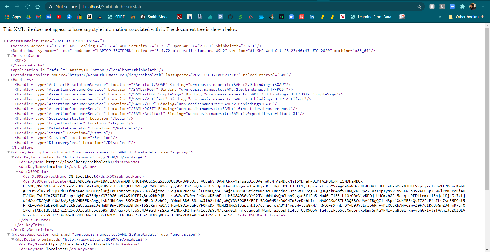
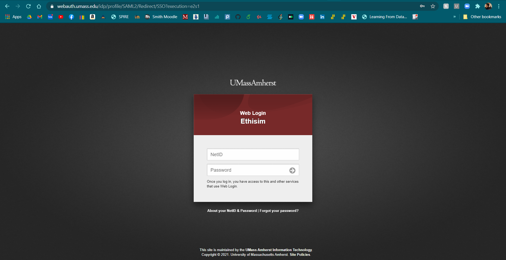

# Setting up and configuring Shibboleth SP with UMass Webauth Locally

1. Getting SP config files.
2. Downloading server prerequisites.
3. Enabling SSL. 
4. Configuring Shibboleth.
5. Checking.

## Getting SP config files

The first step you want to do is to request SP authentication and configuration files.

Go to [https://webauth.umass.edu/admin](https://webauth.umass.edu/admin) and there you can create and manage pre-existing SP tokens.

Select "Create New SP" and follow the steps using the domain of your app. *For local use and testing, just use `localhost` as your domain.*

## Downloading server prerequisites.

For this project we are using Ubuntu 18.04 as our server OS. 

Enter these into your terminal in order:

```bash
$ sudo apt-get update

$ sudo apt install apache2

$ sudo service apache2 restart

$ sudo apt-get install libapache2-mod-shib2
```

## Enabling SSL

Now we need to create enable SSL for our app. This allows us to use the `https` protocol instead of the regular `http` protocol, which is more secure.

Ubuntu 18.04 comes bundled with a self-signed certificate that you can use for local testing, which is located in `/etc/ssl/`. The certificate file is at `/etc/ssl/certs/ssl-cert-snakeoil.pem` and the certificate key file is at `/etc/ssl/private/ssl-cert-snakeoil.key`, which is what the next few commands use.

Run these commands:

```bash
$ sudo a2enmod ssl

$ sudo a2ensite default-ssl.conf
```

After these two commands, SSL should now be enabled, allowing you to access your domain using `https` locally.


## Configuring Shibboleth

Run these commands to enable Shibboleth on the server.

```bash
$ sudo a2enmod auth_basic

$ sudo a2enmod shib2
```

Now get the files you downloaded from the first step and put the `sp-key.pem`, `sp-cert.pem`, `shibboleth2.xml`, and `attribute-map.xml` in `/etc/shibboleth/`.


Then we need to edit the service provider configuration file (`shibboleth2.xml`) using 

```bash
$ sudo nano /etc/shibboleth/shibboleth2.xml
```

Most of the file should be pre-configured, but we have to make a few edits. Near the top of this file, you should see a `Session` tag with a fairly sizeable comment, shown below.

```xml
<!--
Controls session lifetimes, address checks, cookie handling, and the protocol handlers.
You MUST supply an effectively unique handlerURL value for each of your applications.
The value defaults to /Shibboleth.sso, and should be a relative path, with the SP computing
a relative value based on the virtual host. Using handlerSSL="true", the default, will force
the protocol to be https. You should also set cookieProps to "https" for SSL-only sites.
Note that while we default checkAddress to "false", this has a negative impact on the
security of your site. Stealing sessions via cookie theft is much easier with this disabled.
-->
<Sessions lifetime="28800" timeout="3600" relayState="ss:mem"
          checkAddress="false" handlerSSL="false" cookieProps="http">
```

Since in the last step we enabled SSL, we need to set `handlerSSL` to `true` and `cookieProps` to `https`.

### Optional Shibboleth Debugging Configuration

For debugging purposes, you might want to view the status of the SP or possibly the Shibboleth attributes of the logged in user. We will first tackle the former, which is found in a `Handler` tag not too far down from the `Session` tag mentioned above.

```xml
<!--  Status reporting service.  -->
<Handler type="Status" Location="/Status" acl="127.0.0.1 ::1"/>
```

The `acl` attribute of the `Handler` tag lets those accessing the `/Shibboleth.sso/Status` endpoint from the IP addresses specified in the attribute view the status of the SP. In order to make the status accessible to everyone, you can remove all of them (for production, make sure there is at least one IP addresses there, either IPv4 or IPv6).

For the latter, you will find another `Handler` tag with the type `Session` like shown below.

```xml
<!-- Session diagnostic service. -->
<Handler type="Session" Location="/Session" showAttributeValues="false"/>
```

If `showAttributeValues` is `false`, then if you access the `/Shibboleth.sso/Session` endpoint, you will not be able to view the specific session attributes but will see that each attribute has one or more values (i.e. `1 value(s)`). To actually view the values of these attributes, change `showAttributeValues` to `true` (for production, make sure this is set to `false` for security purposes).

In order to add to the attributes returned by the Shibboleth IDP, navigate to `/etc/shibboleth/attribute-map.xml`. There are some commented out attributes that you could uncomment to make retrievable if you so desire. In the same vein, you can comment out unnecessary attributes to reduce the number of environment variables available in Apache's environment.

Once these changes are made, restart Shibboleth with

```bash
$ sudo service shibd restart
```

## Checking

Now to check if all your sweet sweet work paid off, open `https://[server ip]/Shibboleth.sso/Status`, filling in the publicly accesible IP address of the server (can be found through `ifconfig`) as appropriate. In your browser, you should see something like this.



If there are any errors, or it doesn't feel right. You can see the logs at `/var/log/shibboleth/shibd.log`.

If everything looks good so far, open `https://[server ip]/Shibboleth.sso/Login` and enjoy the beauty



# Instructions about adding Shibboleth to the CSCF Server. 
1. Connect to the CSCF server.
2. Recommendation
3. Download and install Repository Package
4. Installation
5. Creating a new SP
6. Testing

## Connect to the CSCF Server
The host that CSCF provided is `ethisim2.cs.umass.edu`, which runs the CentOS operating system. In order to modify files on the server, we had to `ssh` into it using the `cerberus` user (`cerberus@ethisim2.cs.umass.edu`). Enter password when prompted.

## Recommendation
To download software and configuration files, installing curl is recommended. Curl can be installed with:

```bash
$ sudo dnf install curl
```

## Download and install Repository Package
The repository package is maintained by the Shibboleth project. This repository contains the up-to-date version of Shibboleth and it is recommended to use this repository. Below is the command to download and install the repository package.

```bash
$ sudo curl --output /etc/yum.repos.d/security:shibboleth.repo  https://download.opensuse.org/repositories/security:/shibboleth/CentOS_8/security:shibboleth.repo
```

## Installation
Depending on what bit your operating system is, you might have to install a different package. 
If you install both, you will run into some errors when you run Shibboleth. For installing the Shibboleth Service Provider on a 32-bit OS, 

```bash
$ sudo dnf install shibboleth
```
and for a 64-bit OS,

```bash
$ sudo dnf install shibboleth.x86_64
```

If asked to confirm whether you really want to install Shibboleth and all dependencies, answer with 'Y' for yes.
After installation of the package, you need to start and enable the shibd daemon:

```bash
$ sudo systemctl start shibd.service
$ sudo systemctl enable shibd.service
```
The Service Provider should now be installed on the system.


## Creating a new SP
Go to https://webauth.umass.edu/admin/ and create a new SP.
Make sure that the hostname is the server name, in this case `ethisim2.cs.umass.edu`.

## Testing
### Shibboleth Configuration Check
Execute the following command to see whether the Shibboleth Service Provider can load the default configuration:

```bash
$ sudo shibd -t
```

It is important that the last line of the output is:

```bash
overall configuration is loadable, check console for non-fatal problems
```

### Apache Configuration Check
Also, test the Apache configuration with the command:

```bash
$ sudo apachectl configtest
```

The output of this command should be:

```bash
Syntax OK
```

### Check to see if Shibboleth is loaded on the server.
Go to url: [https://ethisim2.cs.umass.edu/Shibboleth.sso/Session](https://ethisim2.cs.umass.edu/Shibboleth.sso/Session).

The web server should return a page that says:

```bash
A valid session was not found.
```

This message shows that the Shibboleth module is loaded by Apache and is communicating with the shibd process.