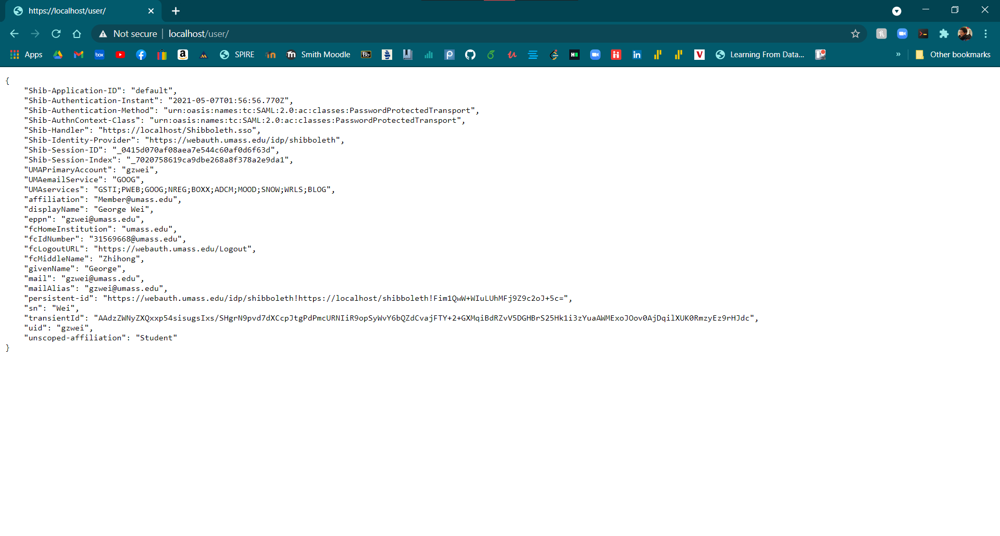

# Documenting Deploying Django on mod_wsgi and Integration Shibboleth 

This is a guide to install and deploy mod_msgi along your apache instillation, which can host any Python web application which supports the Python WSGI specification. In this case Django.

Make sure you have a apache installed ubunter server and install these pre-reqs

``` bash
$ sudo pip3 install virtualenv 
$ sudo apt-get install python3-pip 
$ sudo apt-get install libapache2-mod-wsgi-py3 
```

Then move into your apache web file directory, or create one with

``` bash 
$ sudo mkdir -p /var/www/ethisim.cs.umass.edu 
```

cd into it

``` bash
$ cd /var/www/ethisim.cs.umass.edu 
```

Then start up a virtual environment. We do this to limit any conflict with dependencies, but you can always use a fresh docker container.

``` bash
$ virtualenv venv 
```

Then source the virtual environment to make it the active deployment folder.

``` bash
$ source venv/bin/activate 
```
Now install your selected django version. In this case, we use the latest deployment.

``` bash
$ pip3 install django 
```

Then start the deployment.

``` bash 
$ django-admin startproject shibdjango . 
```

Right now we have django installed, and apache installed, yet nothing is talking to each other.

We must tell apache to enable all the WSGI features through the config.

Open your apache config at `/etc/apache2/conf/apache2.conf` and append it to the bottom.

``` xml
WSGIScriptAlias / /var/www/ethisim.cs.umass.edu/shibdjango/wsgi.py 
WSGIPythonHome /var/www/ethisim.cs.umass.edu/shibdjango/venv
WSGIPythonPath /var/www/ethisim.cs.umass.edu/shibdjango 


<Directory /var/ethisim.cs.umass.edu/shibdjango> 
    <Files wsgi.py> 
        Require all granted 
    </Files> 
</Directory> 
```

Restart apache
``` bash
$ sudo service apache2 restart
```


Great! Now you have django running on your apache server with mod-wsgi along side it.
## Shibboleth integration

Now time to enable Shibboleth integration.

Open up the settings.py in `/var/www/ethisim.cs.umass.edu/shibdjango`

Add your site URL to the `ALLOWED_HOSTS = ["ethisim.cs.umass.edu"]

Next, add a field to the `TEMPLATES` dictionary, namely,  
```
'DIR': [BASE_DIR / 'templates']
```
Then open urls.py in the same directory, and all the way at the bottom, add a path pattern like so.

```
path('user/', views.index),
```

Next, open or create a file called views.py and enter the following configuration.

``` python
import json

from django.shortcuts import render


def index(request):
    keys = [
        'Shib-Application-ID',
        'Shib-Authentication-Instant',
        'Shib-Authentication-Method',
        'Shib-AuthnContext-Class',
        'Shib-Handler',
        'Shib-Identity-Provider',
        'Shib-Session-ID',
        'Shib-Session-Index',
        'UMAPrimaryAccount',
        'UMAemailService',
        'UMAservices',
        'affiliation',
        'displayName',
        'eppn',
        'fcHomeInstitution',
        'fcIdNumber',
        'fcLogoutURL',
        'fcMiddleName',
        'givenName',
        'mail',
        'mailAlias',
        'persistent-id',
        'sn',
        'transientId',
        'uid',
        'unscoped-affiliation'
    ]
    shib_dict = {key: request.META[key] for key in keys}
    json_pretty = json.dumps(shib_dict, sort_keys=True, indent=4)
    return render(request, "user.html", {'meta': json_pretty})
```

Now we are going to create a html template to show the shib attributes we are receiving.

Open `/var/www/ethisim.cs.umass.edu/templates` and crate a file called `user.html` and add the following complex code.

``` html
<pre>
    {{ meta }}
</pre>
```

Open your apache config at `/etc/apache2/conf/apache2.conf` and append the shibboleth specific configurations. Go to ServerName and change it to your identity providers server name.

``` xml
ServerName 'ethisim.cs.umass.edu'
```

Add to the bottom.

``` xml
<Location />
    AuthType shibboleth
    Require shibboleth
</Location>

<Location /Shibboleth.sso>
    SetHandler shib
</Location>
```

Now you're able to see the attributes!

Go to https://ethisim.cs.umass.edu/Shibboleth.sso/Login?target=https://ethisim.cs.umass.edu/user/

IF everything worked well, then you should be able to see all the shib attributes




If you want to implement this exactly, you can get the shibboleth2.xml config from shib_test_sp